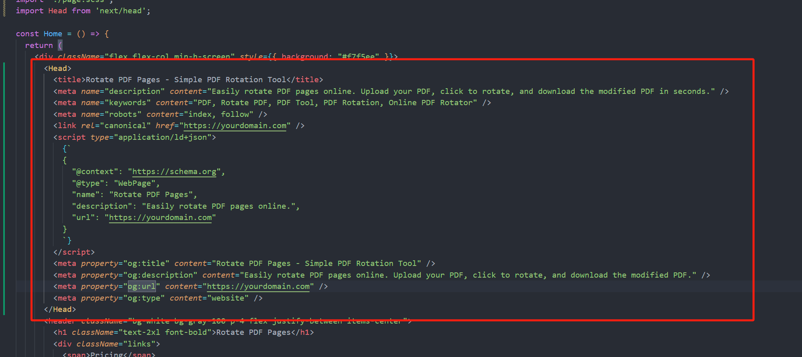
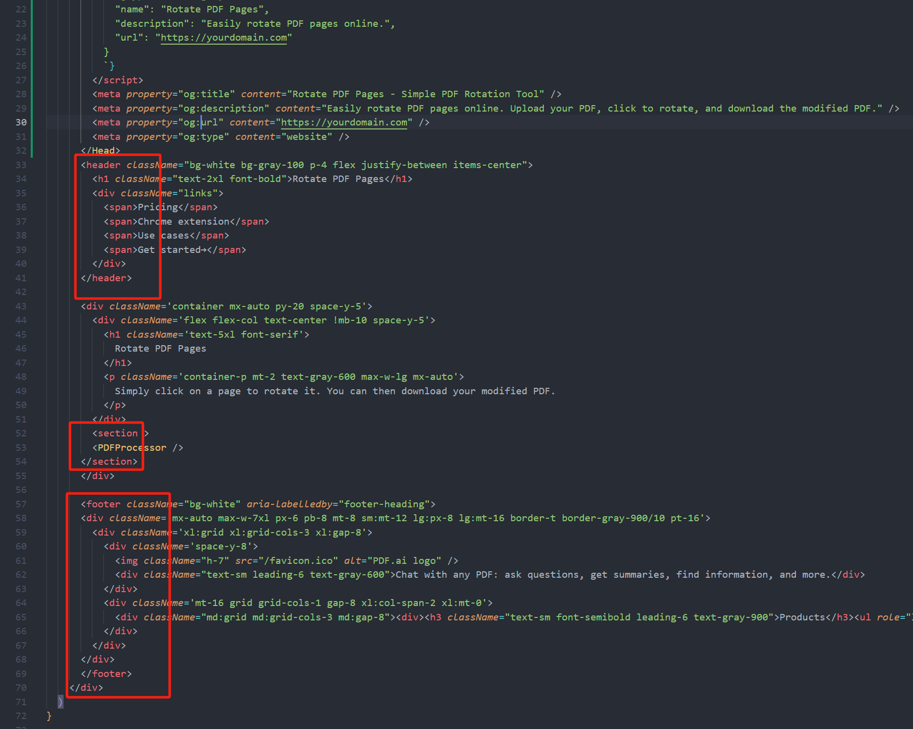

# PDF 处理工具（夏荣文 20241011）

## 概述

PDF 处理工具是一个简单的网页应用，允许用户上传 PDF 文件，旋转页面，并下载修改后的 PDF。该应用使用 React 和 `pdf-lib` 构建，提供了一个直观易用的界面来管理 PDF 文件。

## 演示
[在线演示](https://rotate-server-3a2cq1pnw-xiarongwens-projects.vercel.app/)

## 功能

- 通过拖拽或文件输入上传 PDF 文件。
- 单击页面旋转特定页面。
- 一键旋转所有页面。
- 支持放大和缩小，便于查看。
- 下载修改后的 PDF 文件。

## 技术栈

- **React**：用于构建用户界面。
- **pdf-lib**：用于处理 PDF 文件。
- **react-pdf**：用于在网页上渲染 PDF 页面。
- **Tailwind CSS**：用于快速设计和布局样式。

## 安装

要开始使用该项目，请克隆此代码库并安装必要的依赖项。

```bash
git clone https://github.com/yourusername/pdf-processor.git
cd pdf-processor
npm install
```


## SEO
1. 添加 Meta 标签和结构化数据
在 Home 组件的 Head 部分，添加 meta 标签和结构化数据，以提高搜索引擎的理解能力和排名


2.使用语义化标签 例如header footer标签有利于搜索引擎理解页面结构


lighthouse seo报告


## 遇到的难点
1. 在部署vercel时遇到Error occurred prerendering page "/".报错，一开始以为是APP Router的问题，之后把文件都放在pages文件夹中后继续尝试打包依旧报错，之后排查是否有缺失的数据未使用try catch捕获错误，经过排查后不是这个问题
然后查阅nextjs prerender发现可能是react-pdf组件不支持ssr，然后在page页面引入时把ssr改为false，报错解决

2. 由于react-pdf不支持导出pdf功能，所以这个下载功能需要手动获取到pdf的canvas再转化成blob文件流来下载，所以这一步有点难
